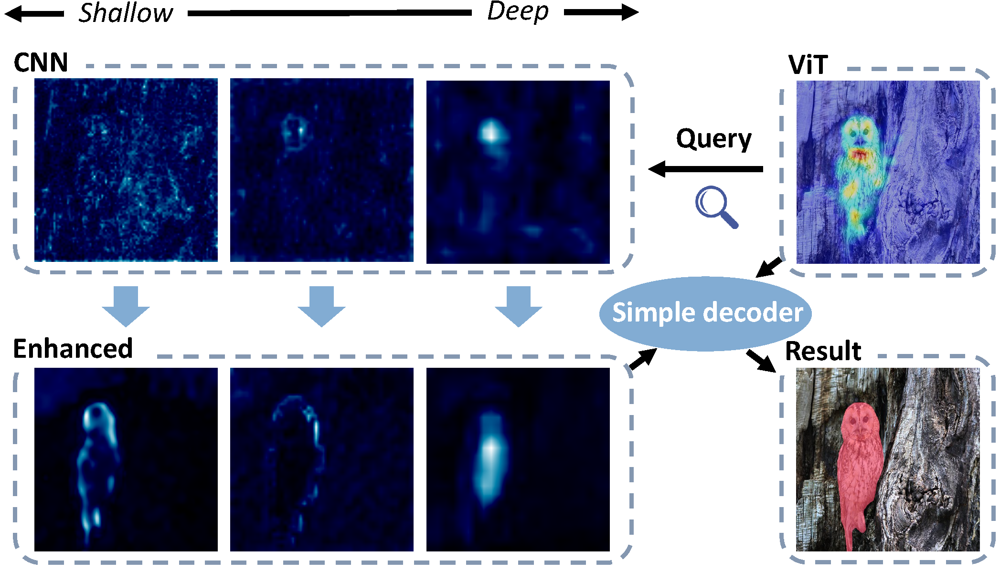
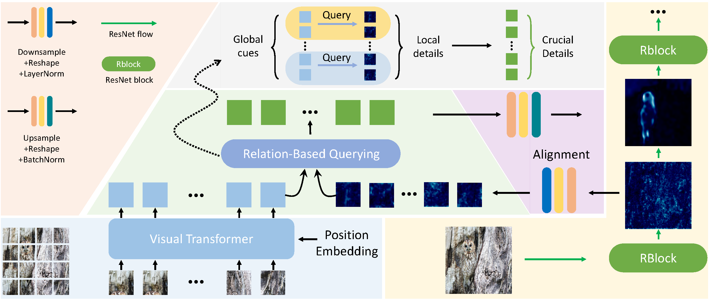
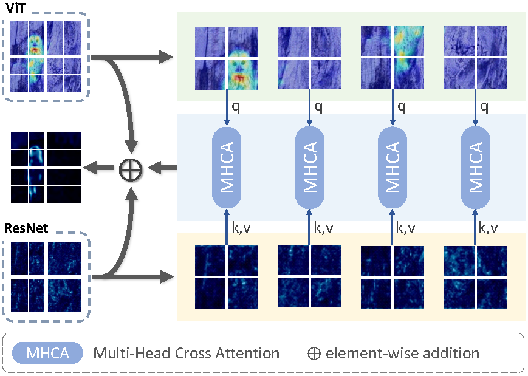
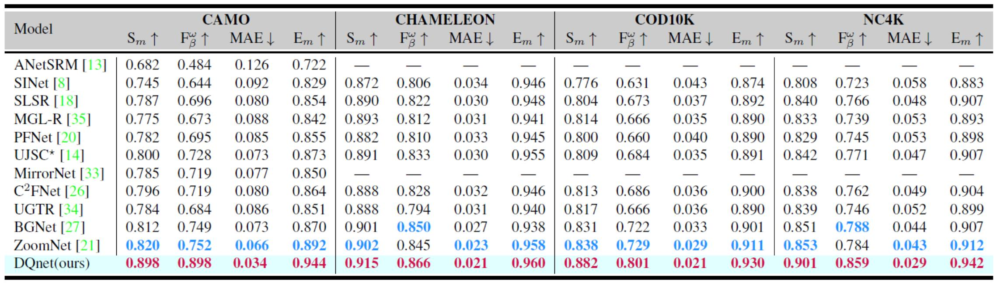
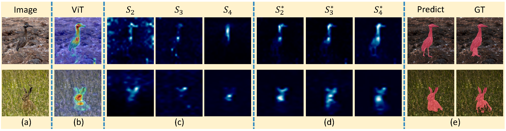

# DQnet: Cross-Model Detail Querying for Camouflaged Object Detection
This is the official implementaion of paper [***DQnet: Cross-Model Detail Querying for Camouflaged Object Detection***]().

## Illustration

With the contextual representation of ViT as global cues, our model queries crucial local details from the multi-scale CNN features. The enhanced representations have clear boundaries as well as few background noise, corresponding
well with underlying camouflaged objects.



## Updates
* 2022-11-11
    - Finished our paper.

## Model 

The model used pretrained weights for ResNet50 and MAE. They can be found at:
- Resnet50: https://pan.baidu.com/s/1zpdmJ22CXK0QQzARLPbmnw (n7cq)
- MAE: https://pan.baidu.com/s/10S9LEcdcoLjuSTCf_ffENg (a9ah)


## Usage

First clone the repository locally:
```
git clone https://github.com/CVPR23/DQnet.git
```

Second download the weights for ResNet50 and MAE.

Some core dependencies:

- timm == 0.4.12
- torch == 1.11.0

More details can be found in <./requirements.txt>


### Datasets
More details can be found at:
- COD Datasets: <https://pan.baidu.com/s/19fYel3STGb5lg27xbQriOA> (gqrg)
- CAMO Datasets: <https://sites.google.com/view/ltnghia/research/camo>
- NC4K Datasets: <https://pan.baidu.com/s/1Mq-tPY0ZUS3NYX2w_MQfKw> (9x4o)
- CHAMELEON Datasets: <http://kgwisc.aei.polsl.pl/index.php/en/dataset/63-animal-camouflage-analysis>


### For training:

You can use our default configuration, like this:

```shell
$ python main.py --model-name=DQnet --config=configs/DQnet/DQnet.py --datasets-info ./configs/_base_/dataset/dataset_configs.json --info demo
```

You can also use :

```shell
$ sh train.sh
```

### For testing:

You can use our default configuration, like this:

```shell
$ python test.py 
```

You can also use :

```shell
$ sh test.sh
```


# Paper Details

## Method Detials

### DQNet


### RBQ



### Comparison




### Visualization of mutil-scale details querying


